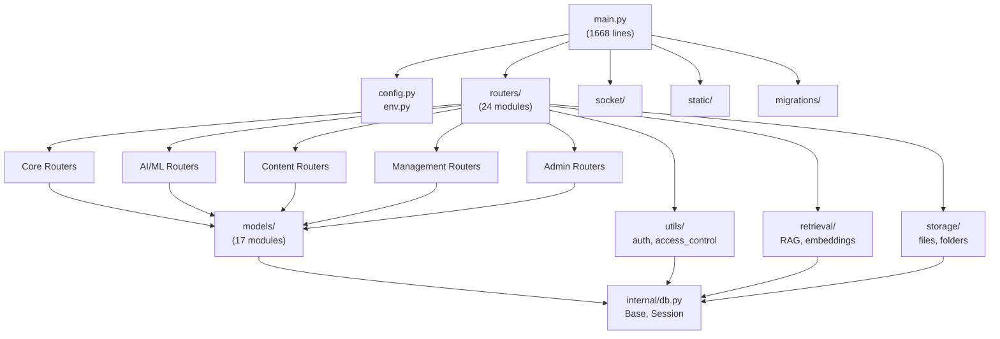
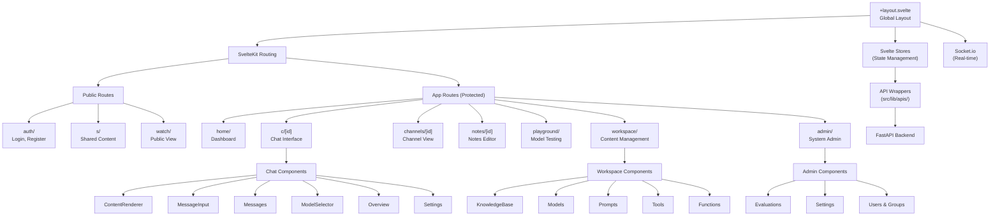
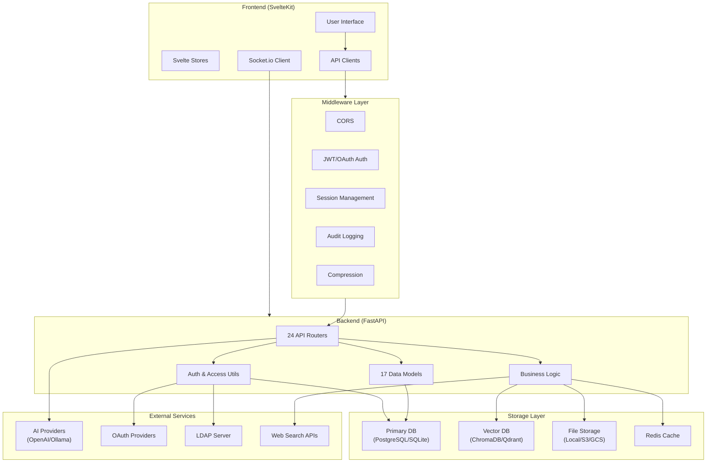

# Dokumentacja Architektury Open WebUI

## Spis treści
1. [Przegląd systemu](#1-przegląd-systemu)
2. [Stack technologiczny](#2-stack-technologiczny)
3. [Architektura backendu](#3-architektura-backendu)
4. [Architektura frontendu](#4-architektura-frontendu)
5. [Główne funkcjonalności](#5-główne-funkcjonalności)
6. [Diagramy architektury](#6-diagramy-architektury)
7. [Przepływy danych](#7-przepływy-danych)
8. [System wielojęzyczności (i18n)](#8-system-wielojęzyczności-i18n)
9. [Zależności i integracje](#9-zależności-i-integracje)
10. [Zalecenia rozwoju](#10-zalecenia-rozwoju)
11. [Podsumowanie](#11-podsumowanie)

---

## 1. Przegląd systemu

Open WebUI to nowoczesna aplikacja webowa do zarządzania rozmowami z modelami AI, zbudowana w architekturze Full Stack z rozdzielonym frontendem i backendem. System oferuje zaawansowane możliwości konwersacji, zarządzania wiedzą, narzędziami i integracjami z zewnętrznymi dostawcami AI.

### Kluczowe cechy:
- **Modularna architektura**: Wyraźny podział na frontend (SvelteKit) i backend (FastAPI)
- **Skalowalna struktura**: 24 moduły routerów i 17 modeli danych
- **Wieloplatformowość**: PWA, Electron, obsługa kontenerów Docker
- **Rozszerzalność**: System pluginów, narzędzi i funkcji użytkownika
- **Bezpieczeństwo**: Wielowarstwowa autoryzacja i kontrola dostępu

---

## 2. Stack technologiczny

### Frontend
- **Framework**: SvelteKit 2.5+ z TypeScript 5.5+
- **Styling**: Tailwind CSS 4.0 z custom theme
- **Komunikacja**: Socket.io-client, fetch API
- **Edytory**: TipTap (rich text), CodeMirror (kod)
- **UI Components**: Bits UI, Svelte Sonner
- **Build Tools**: Vite 5.4+, PostCSS

### Backend
- **Framework**: FastAPI 0.115.7 z Python 3.11+
- **ORM**: SQLAlchemy 2.0.38 + Alembic 1.14.0
- **Validation**: Pydantic 2.10.6
- **Async**: uvicorn, aiohttp, async/await
- **WebSocket**: python-socketio 5.13.0

### Bazy danych
- **Primary**: PostgreSQL / SQLite (z pgvector)
- **Vector DB**: ChromaDB 0.6.3, Qdrant 1.12.0, Milvus 2.5.0, Pinecone 6.0.2, Elasticsearch 9.0.1
- **Cache**: Redis (opcjonalnie)

### AI/ML
- **Models**: OpenAI, Anthropic, Google Gemini, Ollama
- **Embeddings**: sentence-transformers 4.1.0, transformers
- **Audio**: Whisper (faster-whisper 1.1.1), Azure Speech
- **Images**: Automatic1111, ComfyUI, DALL-E

### Storage & Infrastructure
- **Storage**: Local filesystem, S3, Google Cloud Storage, Azure Blob
- **Monitoring**: OpenTelemetry, Langfuse 2.44.0
- **Security**: JWT (PyJWT 2.10.1), OAuth2 (Authlib 1.4.1), LDAP3 2.9.1
- **Testing**: Pytest 8.3.2, Cypress 13.15.0

---

## 3. Architektura backendu

### 3.1. Punkt wejścia
**main.py** (1668 linii) - Centralna konfiguracja FastAPI:
- Lifecycle management z `@asynccontextmanager`
- Middleware stack: CORS, Sessions, Compression, Audit Logging
- Router mounting i obsługa plików statycznych
- WebSocket integration z Socket.io
- OAuth2 manager setup

### 3.2. Struktura modułów

#### Routery (24 moduły HTTP endpointów):

**Core Routers:**
- `auths.py` (957 linii) - Uwierzytelnianie i autoryzacja
- `chats.py` (861 linii) - Operacje na rozmowach  
- `users.py` (426 linii) - Zarządzanie użytkownikami
- `models.py` (204 linii) - Zarządzanie modelami AI

**AI/ML Routers:**
- `ollama.py` (1801 linii) - Integracja z Ollama
- `openai.py` (988 linii) - Integracja z OpenAI/Azure/Gemini
- `retrieval.py` (2188 linii) - RAG i wyszukiwanie wektorowe
- `audio.py` (1120 linii) - Przetwarzanie audio (STT/TTS)
- `images.py` (682 linii) - Generowanie obrazów

**Content Routers:**
- `knowledge.py` (761 linii) - Zarządzanie bazą wiedzy
- `channels.py` (713 linii) - Obsługa kanałów komunikacji
- `files.py` (620 linii) - Operacje na plikach
- `notes.py` (219 linii) - Obsługa notatek
- `memories.py` (199 linii) - Obsługa pamięci kontekstowej

**Management Routers:**
- `tasks.py` (679 linii) - Zarządzanie zadaniami w tle
- `tools.py` (564 linii) - Zarządzanie narzędziami
- `pipelines.py` (511 linii) - Obsługa pipeline'ów przetwarzania
- `functions.py` (504 linii) - Zarządzanie funkcjami użytkownika

**Admin Routers:**
- `configs.py` (323 linii) - Konfiguracja aplikacji
- `folders.py` (266 linii) - Zarządzanie folderami
- `evaluations.py` (171 linii) - System ewaluacji
- `prompts.py` (162 linii) - Zarządzanie promptami
- `utils.py` (136 linii) - Narzędzia pomocnicze
- `groups.py` (132 linii) - Zarządzanie grupami użytkowników

#### Modele danych (17 modeli z integracją Pydantic + SQLAlchemy):
- `auths.py`, `chats.py`, `users.py`, `models.py`, `prompts.py`
- `tools.py`, `functions.py`, `files.py`, `folders.py`, `groups.py`
- `knowledge.py`, `memories.py`, `notes.py`, `channels.py`, `messages.py`
- `feedbacks.py`, `tags.py`

### 3.3. Walidacja danych z Pydantic
```python
class ChatModel(BaseModel):
    model_config = ConfigDict(from_attributes=True)
    
    id: str
    user_id: str
    title: str
    chat: dict
    created_at: int  # timestamp in epoch
    updated_at: int  # timestamp in epoch
```

### 3.4. Bezpieczeństwo
- **JWT tokens** z expiration handling
- **OAuth2 flow** (Google, Microsoft, GitHub, OIDC)
- **LDAP authentication** z TLS support
- **API key management** z endpoint restrictions
- **Role-based access control** (RBAC)
- **Trusted header authentication**

### 3.5. Asynchroniczność
- Wszystkie endpoint handlers używają `async/await`
- Database operations są asynchroniczne
- Background tasks z FastAPI BackgroundTasks
- WebSocket connections dla real-time messaging

---

## 4. Architektura frontendu

### 4.1. Framework SvelteKit
**File-based routing** z automatyczną generacją tras:
```
src/routes/
├── +layout.svelte      # Globalny layout aplikacji
├── (app)/             # Chronione trasy aplikacji
│   ├── admin/         # Panel administracyjny
│   ├── workspace/     # Zarządzanie treścią
│   ├── c/[id]/        # Strony chatów
│   ├── channels/[id]/ # Strony kanałów
│   └── notes/[id]/    # Edytor notatek
├── auth/              # Strony autoryzacji
├── s/[id]/            # Udostępniana treść
└── watch/             # Publiczny podgląd
```

### 4.2. Komponenty modularne
```
src/lib/components/
├── admin/             # Komponenty panelu admin
├── chat/              # Interfejs czatu
│   ├── ContentRenderer/
│   ├── MessageInput/
│   ├── Messages/
│   └── ModelSelector/
├── workspace/         # Narzędzia workspace
│   ├── Knowledge/
│   ├── Models/
│   ├── Prompts/
│   └── Tools/
├── common/            # Komponenty współdzielone
└── layout/            # Komponenty layoutu
```

### 4.3. Zarządzanie stanem
**Scentralizowane Svelte Stores**:
```typescript
// User & Auth State
export const user: Writable<SessionUser | undefined> = writable(undefined);
export const config: Writable<Config | undefined> = writable(undefined);

// Application State
export const chatId = writable('');
export const chats = writable(null);
export const models: Writable<Model[]> = writable([]);

// UI State  
export const showSidebar = writable(false);
export const theme = writable('system');
```

### 4.4. API Integration
**Modułowe API clients** (`src/lib/apis/`):
- Type-safe request/response handling
- Error handling i retry logic
- Automatic token refresh
- Real-time updates via WebSocket

---

## 5. Główne funkcjonalności

### 5.1. Autentykacja i autoryzacja
- **JWT tokens** z konfigurowalnymi czasami wygaśnięcia
- **OAuth2 providers**: Google, Microsoft, GitHub, OIDC
- **LDAP integration** z TLS i certificate validation
- **API keys** z endpoint restrictions
- **Trusted headers** dla zewnętrznych proxy

### 5.2. Zarządzanie konwersacjami
- **Real-time chat** z WebSocket streaming
- **Multiple AI providers**: OpenAI, Anthropic, Google, Ollama
- **Message threading** i conversation branching
- **Chat archiving** i sharing functionality
- **Temporary chat mode** bez zapisywania
- **Tags i categories** dla organizacji

### 5.3. Knowledge Base i RAG
- **Multiple vector databases**: ChromaDB, Qdrant, Milvus, Pinecone
- **Document processing**: PDF, DOCX, PPTX, TXT, Markdown
- **Web scraping** z Playwright i BeautifulSoup
- **Embedding models**: sentence-transformers, OpenAI, Azure
- **Hybrid search** (semantic + keyword)
- **Reranking models** dla lepszej relevance

### 5.4. Tools i Functions
- **Custom tools** z Python execution
- **Direct tool servers** integration
- **Code interpreter** (Pyodide/Jupyter)
- **Function calling** z OpenAI/Anthropic models
- **Pipeline processing** dla batch operations

### 5.5. Multimedia
- **Image generation**: Automatic1111, ComfyUI, DALL-E, Midjourney
- **Speech-to-Text**: Whisper, OpenAI, Azure Speech
- **Text-to-Speech**: OpenAI, Azure, local engines
- **Audio processing** z background tasks

### 5.6. Web Search i Integration
- **Multiple search engines**: DuckDuckGo, Google, Bing, SearXNG, Perplexity
- **Web content loading** z SSL verification
- **Search result filtering** i domain restrictions
- **RAG integration** z web content

### 5.7. Admin i Management
- **User management** z role assignments
- **System monitoring** i health checks
- **Evaluation system** z arena mode
- **Audit logging** dla compliance
- **Configuration management** z persistent storage

---

## 6. Diagramy architektury

### 6.1. Architektura backendu



### 6.2. Struktura frontendu



### 6.3. Przepływ danych w systemie



---

## 7. Przepływy danych

### 7.1. Authentication Flow
1. User loguje się przez frontend (email/password lub OAuth)
2. Auth router waliduje credentials z bazą/LDAP/OAuth provider
3. JWT token generowany z user claims i permissions
4. Token przechowywany w localStorage i HTTP-only cookies
5. Subsequent requests zawierają Bearer token w Authorization header
6. Middleware weryfikuje token i attachuje user context

### 7.2. Chat Flow
1. User wysyła wiadomość przez chat interface
2. Frontend wysyła POST do `/api/chat/completions`
3. Backend:
   - Waliduje permissions i model access
   - Opcjonalnie: RAG retrieval z knowledge base
   - Streaming request do AI provider (OpenAI/Ollama)
   - Real-time streaming response przez WebSocket
   - Asynchroniczne zapisanie do bazy danych
4. Frontend otrzymuje streaming chunks i renderuje odpowiedź

### 7.3. File Upload i RAG Flow
1. User uploada plik przez drag&drop interface
2. Frontend chunkami wysyła do `/api/files/upload`
3. Backend:
   - Waliduje file type i permissions
   - Stores file w skonfigurowanym storage (local/S3)
   - Background task: extract text content
   - Generate embeddings z wybranym modelem
   - Store embeddings w vector database
   - Index w search engine dla hybrid search
4. File dostępny dla retrieval w RAG queries

### 7.4. Real-time Communication
1. WebSocket connection established przy login
2. Socket.io namespaces dla różnych funkcjonalności
3. Real-time events: new messages, user status, typing indicators
4. Redis pub/sub dla multi-instance deployments
5. Graceful fallback do HTTP polling

---

## 8. System wielojęzyczności (i18n)

Open WebUI oferuje rozbudowany system internacjonalizacji (i18n) oparty na bibliotece i18next, zapewniający wsparcie dla 49 różnych języków i regionalnych wariantów językowych.

### 8.1. Architektura i18n

**Framework**: i18next z dodatkami:
- `i18next` 23.16+ - główna biblioteka
- `i18next-resources-to-backend` - dynamiczne ładowanie zasobów
- `i18next-browser-languagedetector` - automatyczna detekcja języka
- `i18next-parser` - automatyczna ekstrakcja kluczy tłumaczeń

**Struktura katalogów**:
```
src/lib/i18n/
├── index.ts                    # Konfiguracja i18next
├── locales/
│   ├── languages.json          # Lista obsługiwanych języków
│   ├── en-US/                  # Język bazowy (angielski US)
│   │   └── translation.json    # Klucze tłumaczeń
│   ├── de-DE/                  # Niemiecki
│   ├── pl-PL/                  # Polski
│   ├── fr-FR/                  # Francuski
│   └── ... 45 innych języków
└── i18next-parser.config.ts    # Konfiguracja parsera
```

### 8.2. Wsparcie językowe

**49 obsługiwanych języków**:
- **Europejskie**: English (US/GB), Deutsch, Français, Español, Italiano, Polski, Nederlands, Svenska, Dansk, Norsk, Suomi, Português (BR/PT), Русский, Українська, Čeština, Hrvatski, Slovenski, Magyar, Română, Български, Ελληνικά, Latviešu, Lietuvių, Eesti
- **Azjatyckie**: 中文简体, 中文繁體, 日本語, 한국어, ไทย, Tiếng Việt, Bahasa Indonesia, Bahasa Malaysia, हिंदी, বাংলা, اردو, فارسی
- **Środkowy Wschód/Afryka**: العربية, עברית, Türkçe, ქართული
- **Inne**: Euskera, Gaeilge, Cebuano, Tibetan, Turkmen

**Konfiguracja językowa**:
```typescript
// src/lib/i18n/locales/languages.json
[
  { "code": "en-US", "title": "English (US)" },
  { "code": "de-DE", "title": "German (Deutsch)" },
  { "code": "pl-PL", "title": "Polish (Polski)" },
  { "code": "zh-CN", "title": "Chinese (简体中文)" },
  // ... pozostałe 45 języków
]
```

### 8.3. Implementacja techniczna

**Automatyczna detekcja języka**:
```typescript
// src/lib/i18n/index.ts
const detectionOrder = defaultLocale
  ? ['querystring', 'localStorage']
  : ['querystring', 'localStorage', 'navigator'];

i18next.use(LanguageDetector).init({
  detection: {
    order: detectionOrder,
    caches: ['localStorage'],
    lookupQuerystring: 'lang',
    lookupLocalStorage: 'locale'
  }
});
```

**Dynamiczne ładowanie tłumaczeń**:
```typescript
const loadResource = (language: string, namespace: string) =>
  import(`./locales/${language}/${namespace}.json`);

i18next.use(resourcesToBackend(loadResource));
```

**Zarządzanie stanem w Svelte**:
```typescript
const createI18nStore = (i18n: i18nType) => {
  const i18nWritable = writable(i18n);
  
  i18n.on('languageChanged', () => {
    i18nWritable.set(i18n);
  });
  
  return i18nWritable;
};
```

### 8.4. Użycie w komponentach

**Kontekst Svelte**:
```svelte
<script>
  import { getContext } from 'svelte';
  const i18n = getContext('i18n');
</script>

<button>{$i18n.t('Save')}</button>
<p>{$i18n.t('Hello, {{name}}', { name: 'User' })}</p>
```

**Selektor języka w UI**:
```svelte
<!-- src/lib/components/chat/Settings/General.svelte -->
<select bind:value={lang} on:change={() => changeLanguage(lang)}>
  {#each languages as language}
    <option value={language.code}>{language.title}</option>
  {/each}
</select>
```

### 8.5. Struktura kluczy tłumaczeń

**Organizacja pliku translation.json** (1379 linii):
```json
{
  "General UI": {
    "Save": "Speichern",
    "Cancel": "Abbrechen", 
    "Delete": "Löschen"
  },
  "Chat Interface": {
    "How can I help you today?": "Wie kann ich Ihnen heute helfen?",
    "Enter your message": "Geben Sie Ihre Nachricht ein"
  },
  "Settings": {
    "Language": "Sprache",
    "Theme": "Erscheinungsbild",
    "Notifications": "Benachrichtigungen"
  },
  "Models": {
    "Select a model": "Wählen Sie ein Modell aus",
    "Model '{{modelName}}' has been successfully downloaded.": "Modell '{{modelName}}' wurde erfolgreich heruntergeladen."
  }
}
```

**Interpolacja zmiennych**:
- Proste zmienne: `{{variable}}`
- Liczby: `{{COUNT}} Available Tools`
- Modele: `This response was generated by "{{model}}"`

### 8.6. Automatyzacja tłumaczeń

**Parser i18next**:
```typescript
// i18next-parser.config.ts
export default {
  input: 'src/**/*.{js,svelte}',
  output: 'src/lib/i18n/locales/$LOCALE/$NAMESPACE.json',
  locales: await getLangCodes(),
  lexers: {
    svelte: ['JavascriptLexer'],
    js: ['JavascriptLexer'], 
    ts: ['JavascriptLexer']
  },
  sort: true,
  verbose: true
};
```

**Automatyczna ekstrakcja kluczy**:
- Skanuje wszystkie pliki `.svelte`, `.js`, `.ts`
- Ekstraktuje wywołania `$i18n.t()`
- Generuje brakujące klucze w plikach językowych
- Sortuje klucze alfabetycznie

### 8.7. Proces lokalizacji

**Workflow tłumaczeń**:
1. **Development**: Dodawanie nowych kluczy w kodzie
2. **Extraction**: Automatyczna ekstrakcja z `i18next-parser`
3. **Translation**: Tłumaczenie przez społeczność
4. **Validation**: Weryfikacja kompletności tłumaczeń
5. **Deployment**: Aktualizacja plików językowych

**Contribution guidelines**:
- Base language: English (US)
- Key format: camelCase lub "natural sentences"
- Context preservation: zachowanie znaczenia w kontekście UI
- Variable handling: prawidłowa obsługa interpolacji
- Cultural adaptation: uwzględnienie różnic kulturowych

### 8.8. Funkcjonalności językowe

**RTL Support**: Obsługa języków pisanych od prawej do lewej (arabski, hebrajski)
**Pluralization**: Obsługa form liczby mnogiej specyficznych dla języka
**Number formatting**: Formatowanie liczb zgodnie z lokalnymi konwencjami
**Date formatting**: Lokalizacja dat z biblioteką dayjs
**Fallback chain**: Łańcuch awaryjny en-US → browser locale → default

### 8.9. Performance i optymalizacje

**Lazy loading**: Dynamiczne ładowanie tylko aktywnych języków
**Bundle splitting**: Separacja plików językowych od głównego bundle
**Caching**: localStorage dla wybranego języka użytkownika
**Tree shaking**: Usuwanie nieużywanych kluczy w production

**Rozmiaru plików tłumaczeń**:
- English (en-US): 49KB (1379 kluczy)
- German (de-DE): 93KB (pełne tłumaczenie)
- Średnio: 50-70KB na język (w zależności od kompletności)

### 8.10. Monitoring i18n

**Completeness tracking**: Monitorowanie kompletności tłumaczeń
**Missing keys detection**: Wykrywanie brakujących kluczy
**Unused keys cleanup**: Usuwanie nieużywanych kluczy
**Translation quality**: Community feedback na jakość tłumaczeń

---

## 9. Zależności i integracje

### 9.1. Core Dependencies

**Backend (Python 3.11+)**:
```python
# Core Framework
fastapi==0.115.7
uvicorn[standard]==0.34.0
pydantic==2.10.6
sqlalchemy==2.0.38
alembic==1.14.0

# AI/ML
openai
anthropic
google-genai==1.15.0
transformers
sentence-transformers==4.1.0

# Vector Databases
chromadb==0.6.3
pymilvus==2.5.0
qdrant-client~=1.12.0
pinecone==6.0.2
elasticsearch==9.0.1

# Security
PyJWT[crypto]==2.10.1
authlib==1.4.1
passlib[bcrypt]==1.7.4
ldap3==2.9.1
```

**Frontend (Node 18+)**:
```json
{
  "dependencies": {
    "@sveltejs/kit": "^2.5.20",
    "svelte": "^4.2.18",
    "typescript": "^5.5.4",
    "tailwindcss": "^4.0.0",
    "socket.io-client": "^4.2.0",
    "@tiptap/core": "^2.11.9",
    "codemirror": "^6.0.1",
    "mermaid": "^11.6.0"
  }
}
```

### 9.2. Externí integracje

**AI Providers**:
- OpenAI GPT-4, GPT-3.5, DALL-E, Whisper
- Anthropic Claude models
- Google Gemini Pro/Flash
- Ollama local models
- Azure OpenAI Services

**Vector Databases**:
- ChromaDB (default, lightweight)
- Qdrant (production-ready)
- Milvus (enterprise scale)
- Pinecone (managed cloud)
- Elasticsearch (hybrid search)

**Storage Backends**:
- Local filesystem (development)
- AWS S3 (production)
- Google Cloud Storage
- Azure Blob Storage

**Authentication Providers**:
- Google OAuth2
- Microsoft Azure AD
- GitHub OAuth
- Generic OIDC providers
- LDAP/Active Directory

---

## 10. Zalecenia rozwoju

### 10.1. Architektura i skalowalność

**Backend optimizations**:
- Implementacja Redis cache dla frequently accessed data
- Database connection pooling z pgbouncer
- Async task queue z Celery/RQ
- API rate limiting z Redis
- Database read replicas dla read-heavy workloads

**Frontend optimizations**:
- Component lazy loading z dynamic imports
- Virtual scrolling dla długich konwersacji
- Service Worker dla offline capabilities
- Bundle splitting i tree shaking
- Image optimization z next-gen formats

### 10.2. Monitoring i observability

**Backend monitoring**:
- OpenTelemetry tracing dla request flows
- Prometheus metrics dla performance monitoring
- Structured logging z correlation IDs
- Health checks z dependency verification
- Error tracking z Sentry integration

**Frontend monitoring**:
- Real User Monitoring (RUM)
- Core Web Vitals tracking
- Error boundary implementation
- Performance budgets enforcement
- A/B testing framework

### 10.3. Security enhancements

**Authentication security**:
- Multi-factor authentication (MFA)
- Session security z rotation
- CSRF protection
- Content Security Policy (CSP)
- Input validation i sanitization

**Infrastructure security**:
- Container security scanning
- Secrets management z Vault
- Network policies w Kubernetes
- Database encryption at rest
- TLS termination z proper certificates

### 10.4. Testing strategies

**Backend testing**:
- Unit tests z pytest fixtures
- Integration tests z test database
- Load testing z Artillery/Locust
- Contract testing z Pact
- Security testing z OWASP ZAP

**Frontend testing**:
- Component tests z Vitest
- E2E tests z Playwright/Cypress
- Visual regression testing
- Accessibility testing z axe-core
- Performance testing z Lighthouse CI

---

## 11. Podsumowanie

Open WebUI reprezentuje nowoczesną, skalowalną architekturę full-stack application z wyraźnym podziałem odpowiedzialności i przemyślaną strukturą modułową. System demonstruje best practices w:

### 11.1. Architektoniczne zalety
- **Modular Design**: 24 routery backendu i komponentowa struktura frontendu
- **Type Safety**: TypeScript + Pydantic dla end-to-end type safety
- **Async Programming**: Pełne wykorzystanie async/await w całym stacku
- **Real-time Communication**: WebSocket z graceful fallbacks
- **Security First**: Wielowarstwowa autoryzacja i walidacja

### 11.2. Technologiczne mocne strony
- **Modern Stack**: FastAPI + SvelteKit z najnowszymi wersjami
- **Database Flexibility**: Support dla multiple primary i vector databases
- **AI Integration**: Unified interface dla multiple AI providers
- **Storage Agnostic**: Configurable storage backends
- **Deployment Ready**: Docker, Kubernetes, PWA support

### 11.3. Przygotowanie na przyszłość
- **Extensible Architecture**: Plugin system dla custom tools/functions
- **API-First Design**: RESTful API z comprehensive documentation
- **Cloud Native**: Microservice-ready z proper health checks
- **Progressive Enhancement**: PWA capabilities z offline support
- **Community-Driven**: Open source z active development

### 11.4. Możliwości rozwoju
System jest przygotowany do:
- Horizontal scaling z load balancers
- Microservice extraction gdy potrzebne
- Multi-tenant deployments
- Enterprise integrations (SSO, LDAP, compliance)
- Custom AI model integrations
- Advanced RAG workflows

Open WebUI stanowi solidną podstawę dla enterprise-grade AI conversation platform z możliwością adaptacji do różnorodnych use cases i wymagań skalowalności.

---

*Dokumentacja wersja 1.0 - Grudzień 2024*  
*Ostatnia aktualizacja: 2024-12-21* 